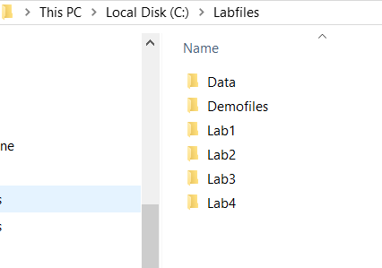

Exercise 2: Parameterised Queries 
----------------------------------

In this exercise you will download and install the exercise files and lab
solutions from a shared location on the internet. These files must be installed
to C:\\LabFiles for the solutions to work correctly without modification. There
are many other resources and references for further study at this location, feel
free to access them in your own time.

####  Task 1: Download the Power BI Essentials course files

1.  Open a new browser window and navigate to: <https://tinyurl.com/yd8r2uha>.

2.  Click on the labfiles icon to download the **labfiles.zip** archive.

3.  This will save the file to the default **Downloads** folder

4.  Once the download is complete, open File Explorer to the **Downloads**
    folder.

5.  Right click the **labfiles.zip** file and choose **Extract All**.

6.  Enter the folder name of C:\\ to extract the files to.

7.  This will create a new folder called: **C:\\Labfiles** with the following
    folder structure.

>   .

>   **Note:** If you extract the files to a different location some of the lab
>   solution files will no longer work correctly. You will need to change the
>   source path to the new location if you do so.

End of Exercise
