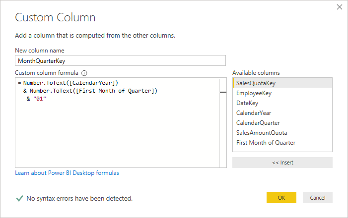
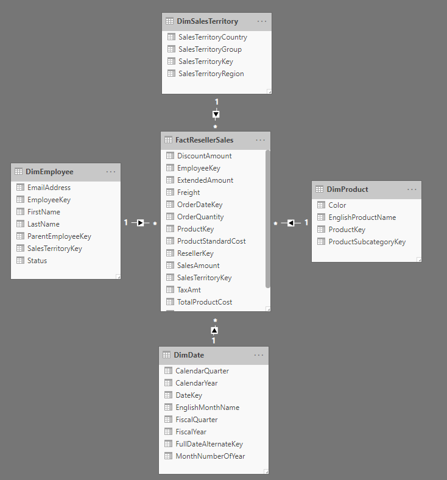

Working with DAX
================

Exercise 3: Budget vs Actuals 
------------------------------

#### Scenario 

>   Sales Quota: Different Granularity

>   For this example, instead of the budget data, I have Sales Quota which is
>   under a different granularity. The concept and principles remain the same.
>   we have a table with a different granularity which we want to connect to
>   this model. The Sales Quota has the quota of sales for each employee in each
>   quarter. The granularity of this table is per employee and per quarter,
>   while the granularity of the sales table is per employee, per day, and per
>   combination of SalesTerritory and Product also.

>   If you get the FactSalesQuota from the AdventureWorksDW, you will notice
>   that there is a Date column, and the DateKey, which I have removed in my
>   example below, because they will be confusing for you to understand the
>   table is showing quarterly data (we will calculate the date key later on in
>   this article)

>   Here is how the data in the Sales Quota table looks like: (FactSalesQuota in
>   the AdventureWorksDW)

>   The main tasks for this exercise are as follows:

-   Download the Power BI Desktop installer.

-   Install the Power BI Desktop.

>   Estimated Time to complete: 15 min

####  Task 1: Start Power BI Desktop

1.  Start the Power BI Desktop and create a new blank query

2.  Open the advanced editor and re0place the query with the following

. Challenges of Two Different Granularities
-------------------------------------------

If you want to build the star schema for Sales Quota and Sales (similar to
Actual vs Budget), then the challenge would be;

-   How to connect The Sales Quote to the date table?

-   If I create a Quarter dimension, then how to connect Quarter dimension to
    the date dimension? does this create a snowflake scenario?

I’m going to explain an easy method to solve it and then it will be a proper
star schema again. Let’s check it out.

####  Task 2: Create a data source connection 

1.  Manually code a SQL Server connection

neConnect SalesQuota to the Date Table
--------------------------------------

Although the sales quota information is quarterly based, you can still connect
it to the date table. This would avoid creating an extra dimension for the
quarter and snowflake between quarter dimension and the date dimension. The only
thing to consider is that you have to consider a specific date in each quarter
as your default value. For example, we can consider the first day of each
quarter as our date value.

To achieve, this purpose, we need to create a column in the SalesQuota table
with has the DateKey in it (the DateKey used in my sample is in this format
YYYYMMDD), so It can be something like 20190101, 20190401, and etc). This is
what we are going to build in this part:

1.  xt exercise to download and install the lab exercise files.

End of Exercise
